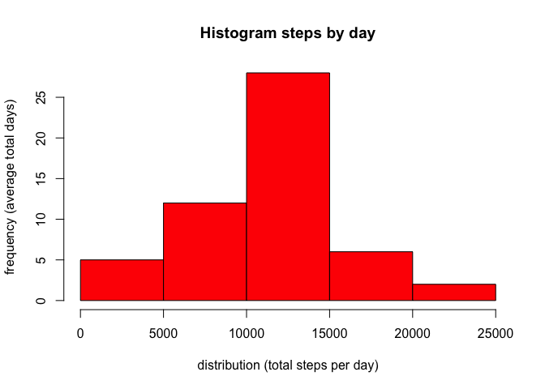
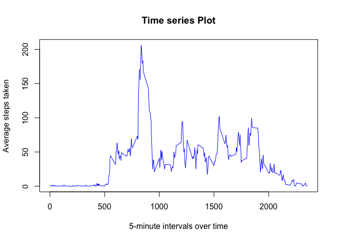
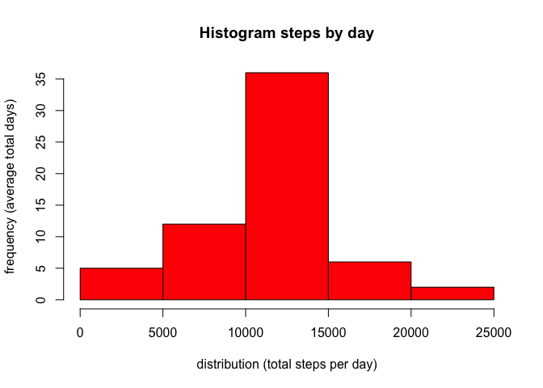
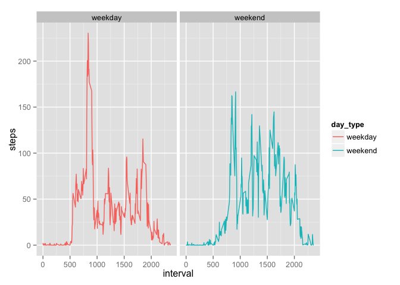

# Reproducible Research: Peer Assessment 1


## 1\. Loading and preprocessing the data

1. Unzip the activity data.
2. Read the csv data from the returned `filepath`.
3. Read the date column as a date type an store it into a day field.
4. Remove the unzipped activity csv file.


```r
filepath <- unzip("activity.zip")
data <- read.csv(filepath, stringsAsFactors = F)
data$day <- as.Date(data$date, "%Y-%m-%d")
unlink(filepath)
```

## 2\. What is mean total number of steps taken per day?

#### 2\.1\. Histogram of total steps taken per day

1. Load the [dplyr](https://cran.r-project.org/web/packages/dplyr/index.html) data manipulation package.
2. Group the `data` by day, and sum the `steps` by day. Store the result into the variable `steps_by_day`.
3. Plot a histogram of the total number of `steps` taken per day.


```r
library(dplyr)
```

```
## 
## Attaching package: 'dplyr'
## 
## The following object is masked from 'package:stats':
## 
##     filter
## 
## The following objects are masked from 'package:base':
## 
##     intersect, setdiff, setequal, union
```

```r
steps_by_day <-
  group_by(na.omit(data), day) %>%
  summarise(steps = sum(steps))

hist(steps_by_day$steps,
  main = "Histogram steps by day",
  xlab = "distribution (total steps per day)",
  ylab = "frequency (average total days)",
  col = "red")
```

 

We can see the following from the histogram the following:

- In the first bin we have an average of `5` days where we have an total steps distribution in between `0..5000` steps per day.
- In the middle bin an average of approximately `25` days where the distribution lies in between `10000-15000` steps per day.
- In the last bin an average of about `2` days where the distribution lies in between `20000-25000` steps per day.

#### 2\.2\. Report the mean and median of total number of steps taken per day.

We summarize the mean and median from the previous `steps_by_day` variable,
and report them.


```r
steps_by_day_summary <- summarise(steps_by_day,
  mean = mean(steps),
  median = median(steps))

cat(sprintf("Mean:   %0.2f\nMedian: %0.2f",
  steps_by_day_summary$mean,
  steps_by_day_summary$median))
```

```
## Mean:   10766.19
## Median: 10765.00
```


## 3\. What is the average daily activity pattern?

1. Group the `data` by interval, and get the mean average the steps by interval. Store the result into the variable `steps_by_interval`.
2. Plot a time series over the 5-minute interval and the average steps taken every 5-minute across the days.
3. Sort the `steps_by_interval` by steps in descending order, and display the first row with the max number of steps and its interval.


```r
steps_by_interval <-
  group_by(na.omit(data), interval) %>%
  summarise(steps = mean(steps))

with(steps_by_interval,
  plot(x = interval, y = steps,
    type = "l",
    col = "blue",
    main = "Time series Plot",
    xlab = "5-minute intervals over time",
    ylab = "Average steps taken"))
```

 

```r
arrange(steps_by_interval, desc(steps)) %>%
  head(1)
```

```
## Source: local data frame [1 x 2]
## 
##   interval    steps
## 1      835 206.1698
```

We can see from the plot the following:

- Activity steps starts usually around 5am in the morning and peaks between 8-9am.
- Then it's steady from 10 am to around 20pm where the activity steps decreases.

The max average steps is at 8:35 in the morning with an average of `206` steps.

## 4\. Imputing missing values

#### 4\.1\. Report the total number of missing values.


```r
total_na <-
  is.na(data$steps) %>%
  sum()

sprintf("The total number of rows with NA's is: %d", total_na)
```

```
## [1] "The total number of rows with NA's is: 2304"
```

#### 4\.2\. Filling the missing values in the dataset.

We decided to use the mean steps by interval to fill in the missing data.
Since this is can be seen as the mean average steps by given interval across all days.


#### 4\.3\. Create a new dataset with the missing data filled in

1. Copy all the `data` via the `select` command from the `dplyr` library into a new variable `data2`.
2. Iterate over all the rows in `data2`. If the steps for given row is empty. Then get the logical vector `lv` where the `interval` for given row matches the `steps_by_interval`. Cope the `steps` where the logical vector `lv` matches and replace it with the missing `steps` value for the current given row.
3. Group the `data2` by day, and sum the `steps` by day. Store the result into the variable `steps_by_day2`.


```r
data2 <- select(data, steps:day)

for (i in seq_along(1:nrow(data2))) {
  steps <- data2$steps[i]
  if (is.na(steps)) {
    lv    <- steps_by_interval$interval == data2$interval[i]
    steps <- steps_by_interval[lv,]$steps

    data2$steps[i] <- steps
  }
}

steps_by_day2 <-
  group_by(data2, day) %>%
  summarise(steps = sum(steps))
```

#### 4\.4\. Plot a histogram and calculate mean and median total

1. Plot histogram
2. We summarize the mean and median from the previous `steps_by_day2` variable,
and report them.


```r
hist(steps_by_day2$steps,
  main = "Histogram steps by day",
  xlab = "distribution (total steps per day)",
  ylab = "frequency (average total days)",
  col = "red")
```

 

```r
steps_by_day_summary2 <- summarise(steps_by_day2,
  mean = mean(steps),
  median = median(steps))

cat(sprintf("Mean:   %0.2f\nMedian: %0.2f",
  steps_by_day_summary2$mean,
  steps_by_day_summary2$median))
```

```
## Mean:   10766.19
## Median: 10766.19
```

We can see from the new histogram plot for the `steps_by_day2` with imputed values, that the middle bin differs from the histogram for the previous histogram plot of `steps_by_days` where we omit the missing values. In the new histogram plot we have approximately `35` days where where the distribution lies in between `10000-15000` steps per day, versus approximately `25` days in the previous histogram. Omitting values can have a negative impact in the sense that we can get a biased and wrong view of the results. Here the difference is very large would the difference had been one day it would not made that much a difference but a difference about 10 days is a large difference in the case that we are missing values for the steps in the 5-minute interval of the days where there is most activity.


The `mean` value does not change and remains the same value `10766.19`, for the both datasets. However the `median` value has changes from `10765.00` for the first dataset to `10766.19` for the second dataset. We have an `median` that is the same as the `mean`, and we have an distribution where the data is evenly divided around the mean.


## 5\. Are there differences in activity patterns between weekdays and weekends?

#### 4\.1\. Create day type column

1. Get weekday from the `day` date.
2. Set default `day_type` to *"weekday"*.
3. Create logical vector `lv` to match rows where the weekday is either *"Saturday"* or *"Sunday"*.
4. Subset all rows that match the logical vector `lv`, and set the `day_type` to weekend.


```r
data2$weekday  <- weekdays(data2$day)
data2$day_type <- "weekday"

lv = data2$weekday == "Saturday" | data2$weekday == "Sunday"
data2[lv,]$day_type <- "weekend"
```

#### 4\.2\. Time Series plot over 5-minute interval by day type

1. Load the [ggplot2](http://ggplot2.org) plotting library.
2. Group the `data2` by interval and day_type. Get the mean average the steps by interval. Store the result into the variable `steps_by_interval_and_day_type`.
3. Create a time series panel plot divided over the 5-minute interval and the average steps taken every 5-minute across the weekdays versus weekends.


```r
library(ggplot2)

steps_by_interval_and_day_type <-
  group_by(data2, interval, day_type) %>%
  summarise(steps = mean(steps))

qplot(interval, steps, data = steps_by_interval_and_day_type, facets = . ~ day_type, color = day_type, geom = c("line"), method = "lm")
```

 

We can see from the plot the following:

- There is much more activity in the weekdays around 8-9am, which indicates that the person most probably is heading off to work at this point.
- There is more even and higher activity from  10am - 20pm in the weekends than in the weekdays. We could deduce that there is in general more activity in the weekends that  includes result in more steps such as walks, trim and/or kids. Versus most probably sitting at work in the weekdays.
